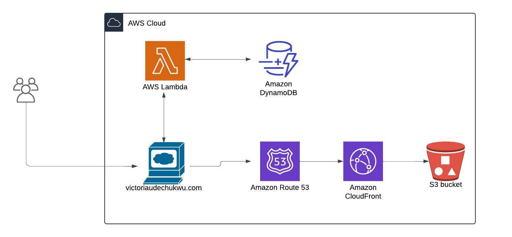

# **Cloud Resume Challenge**

## **Overview**

This project is my implementation of the **Cloud Resume Challenge**, showcasing my skills in cloud engineering by deploying a personal resume website fully hosted on AWS.

The project highlights the use of AWS cloud services, serverless architecture, and CI/CD pipelines to build and manage a dynamic website.

## **Key Features**

- **Static Website Hosting**: Deployed on AWS S3 with global distribution via CloudFront.
- **Custom Domain**: Configured using Route 53 with HTTPS enabled via AWS Certificate Manager.
- **Visitor Counter**: Tracks and displays the number of unique visitors using DynamoDB and a Python Lambda function.
- **CI/CD Pipeline**: Automates deployments to S3 with GitHub Actions.

---

## **Architecture Diagram**

---

## **Implementation Steps**

### 1. **Frontend Setup**

- Used the [Start Bootstrap Resume Template](https://startbootstrap.com/theme/resume) to speed up frontend development.
- Customized the template to reflect my personal resume details.
- Created a GitHub repository and pushed the code.

### 2. **Website Hosting**

- Created an S3 bucket and uploaded the static website files.
- Set up a CloudFront distribution for global content delivery and allowed access to the S3 bucket.
- Purchased a domain using Route 53 and linked it to the CloudFront distribution.
- Configured an SSL certificate using AWS Certificate Manager to enable HTTPS for the domain.

### 3. **Visitor Counter**

- Created a DynamoDB table to store visitor counts.
- Developed an AWS Lambda function in Python using Boto3 to retrieve and update the visitor count.
- Enabled Lambda Function URL for seamless API integration without using API Gateway.
- Updated the Lambda function's permissions to access DynamoDB.

### 4. **Frontend Integration**

- Added JavaScript to the website to make API calls to the Lambda function.
- Retrieved visitor data, updated the count for new users, and displayed it on the website.

### 5. **CI/CD Pipeline**

- Configured GitHub Actions to automate deployments to the S3 bucket.
- Ensured changes to the repository trigger automatic builds and updates.

---

## **How to Access**

[**Live Website**](https://victoriaudechukwu.com/)  
[**GitHub Repository**](https://github.com/vikyij/victoria-cloud-resume)

---

## **Technologies Used**

- **Frontend**: HTML, CSS, JavaScript
- **AWS Services**: S3, CloudFront, Route 53, DynamoDB, Lambda, Certificate Manager
- **CI/CD**: GitHub Actions
- **Programming**: Python (Boto3)
